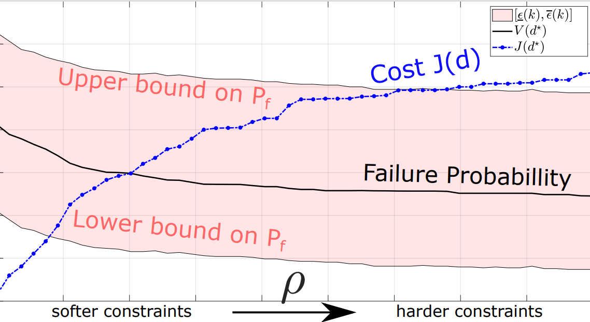
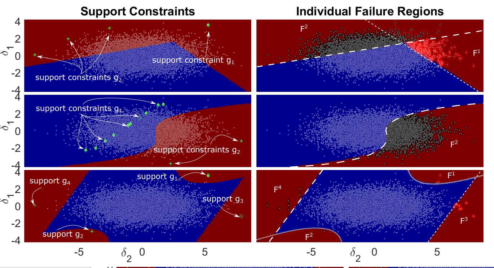

# ScenarioRBDO
 
### References

**Scenario Risk-based design for convex reliability functions (constraints relaxation) 

[] Garatti, Simone & Campi, Marco. (2019). Risk and complexity in scenario optimization. Mathematical Programming. https://doi.org/10.1007/s10107-019-01446-4

[] Roberto Rocchetta, Luis G. Crespo, "_A scenario optimization approach to reliability-based and risk-based design: Soft-constrained modulation of failure probability bounds_" , Reliability Engineering & System Safety, Volume -, 2021, ...

``` bibtex
@article{ROCCHETTA2021107900, title = {A scenario optimization approach to reliability-based and risk-based design: Soft-constrained modulation of failure probability bounds}, journal = {Reliability Engineering & System Safety}, volume = {216},pages = {107900},year = {2021},issn = {0951-8320}, doi = {https://doi.org/10.1016/j.ress.2021.107900}, url = {https://www.sciencedirect.com/science/article/pii/S095183202100418X}, author = {Roberto Rocchetta and Luis G. Crespo}}
```

** Scenario RBDO for non-convex problems

[] Roberto Rocchetta, Luis G. Crespo, Sean P. Kenny, "_A scenario optimization approach to reliability-based design_", Reliability Engineering & System Safety, Volume 196, 2020, 106755, ISSN 0951-8320, https://doi.org/10.1016/j.ress.2019.106755.

[] Roberto Rocchetta, Luis G. Crespo, Sean P. Kenny, "_Solution of the benchmark control problem by scenario optimization_", Dynamic Systems and Control Conference, 2019, https://doi.org/10.1115/DSCC2019-8949


## Soft-Constrained Scenario Reliability-Based Design Optimization (RBDO) 

This work uses scenario optimization theory to solve RBDO problems given data. Specifically,a soft-constrained optimization program is used to solve RBDO problems. A mode of the uncertainty it is not needed to carry on with the RBDO. Thus, scenario-based solutions of RBDO problems are not biased by unwarranted assumptions on the uncertain quantities given a lack of statistical samples. Scenario theory prescribes powerful  bounds on the reliability of the system. These bounds (prospective-reliability bounds) hold distribution free, non asymptotically and quantify the uncertainty affecting the desing and which is due to 1) lack of data  2) overly complex design solutoins 

<p align="center">
  
</p>
 

An example is presented in: 
**run MAIN_RBDO_withSoftScenarioConstraints_Extended.m

### Program-1 (soft-constrained joint reliability requirements)
```
 % min_{d\in \Theta , \zeta^{(i)}>0} \ lbrace J(d) +\rho \sum\limits_{i=1}^{N}  \zeta^{(i)}
 Such that: w(d,\delta{(i)} \leq \zeta^{(i)} \rbrace

 where
 \delta are the available scenarios (samples of the uncertain factors)
 d\in \Theta is a design vector (e.g. fitting coefficients, tunable parameters etc) in a convex design set \Theta
 J(d) is a convex cost function
 $\rho$ is a parameter weighting the cost of violating constraints and
 w(d,\delta)=\max\limits_{j\in\{1,..,n_g \}| g_j(d,\delta) % w is a convex worst-case reliability performance function,
 n_g  is the number of individual reliability requirements defined by the performance functions g_j j=1,...,n_g
 ```
### Program-2 (soft-constrained individual reliability requirements)
```math
% min_{d\in \Theta , \zeta_j^{(i)}>0} \ lbrace J(d) +\sum\limits_{j=1}^{n_g} \rho_j \sum\limits_{i=1}^{N}  \zeta_j^{(i)}
% Such that: g_j(d,\delta) \leq \zeta_j^{(i)} i=1,...,N,~j=1,..,n_g\rbrace
% where $\rho_j$ are parameters weighting the cost of violation on the reliability requirement g_j

% for this probelm the support scenarios (complexity is S_N*)
% S_N^*= the number of active constriaints + the number of violating constraints
```
### Reliability bounds via Scenario optimization theory
Pobability[Pf(d*)<\epsilon]>1-\beta
where \beta is a small confidence parameter selected by the analyst and
\epsilon is a reliabiity bounds provided by scenario theory
fixing a confidence \epsilon is a function f(N,\beta,sN^*)
where N is the number of samples in program 1 and 2 and
s_N^* start is the complexity of the solution


  


### Description of the CLASS ScenarioRBDO  (scenario RBDO for non convex problems)

This class introduces a set of methods and proprieties to perform reliability-based-design-optimization by Scenario theory. 
Scenario optimization makes direct use of the available data (the uncertain parameters delta) 
thereby eliminating the need for estimating the distribution of the uncertain parameters.

Furthermore, scenario theory enables rigorously quantifying the probability of the resulting design satisfying the reliability requirements
imposed upon it regarding future, unseen data. (see Robustness methods) 

 <p align="center">
  
</p>


### Reliability Methods: 

% INPUT: a system desing (d)

        Compute_Gfun(d): evaluates the performance function g=[g1,..,gNg]
        Compute_FailureProbability(d): evaluates the overall Pf on the available scenarios
        Compute_maxG(d):
        Compute_W(d)
        Compute_ReliabilityMetrics(design)

###  Scenario Optimization Methods:
 
     Th program SP2 minimize Pf (to this end it does not induce constraints)
     NLCon-  NonLinearConstraint(theta,alpha,Gexamined,Gdeltaidx) % evaluate
     non linear constraints for program SP1 or SP3

    SP-1)    Optimize_SP1(alpha,Theta0):  minimizes alpha percentile of w (using fmincon)
    SP-2)    Optimize_SP2(): minimizes Pf given-data (using GA);
    SP-3)    Optimize_SP3(alpha,Theta0,Gexamined,Gdeltaidx):minimizes the sum
             of the alpha percentiles of each requitement g_j with j=1,..,Ng  (using fmincon)

###  Robustness method
     getEpsilon(k,beta)  gets the non-convex robustness given cardinality k  and confidence beta (scenario size N is within the object)
 
     ScenarioConstraints_addMethod (for SP1 and SP3)
     ScenarioConstraints_removeMethod (for SP1 and SP3)

###   Outlier Removal Method
     RemoveConstraints re-optimizes removing a list of scenario from the initial data set

 
###   Data visualization methods
      plot_deta_vs_G scatter: the scenarios in the uncertainty space (2-D) vs the performance function realizations
      plot_detaIndex_vs_G sort and plot the gj and the scenarios indices w.r.t. one of the reliability requirement
      plot_2D_SafeFailDomains_and_Scenarios % plot failure and safe regions
      Plot_ScenarioConstraints : plot a list of scenario constraints
